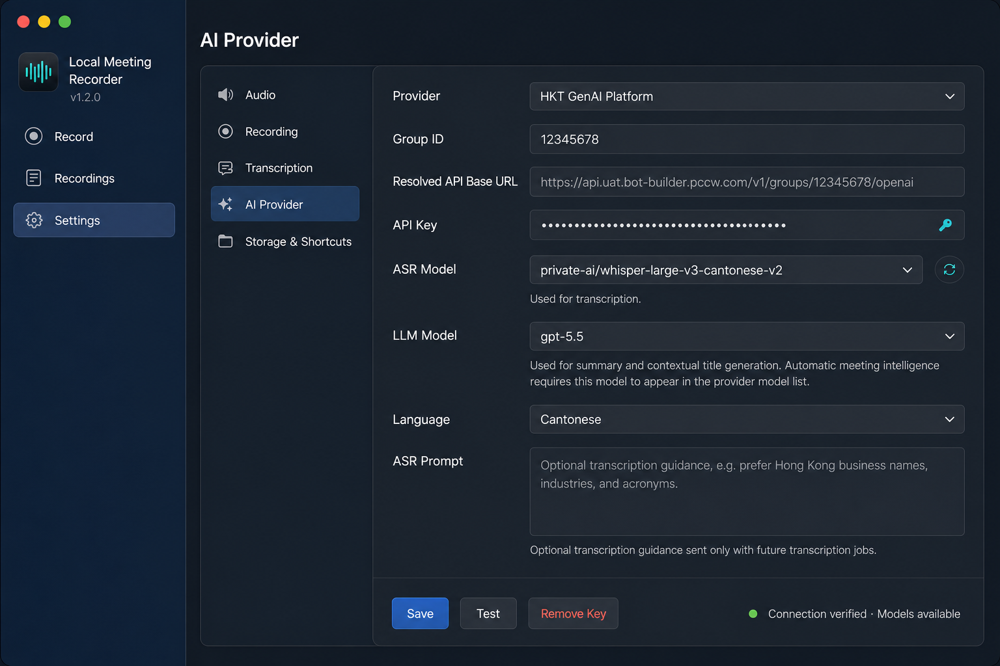
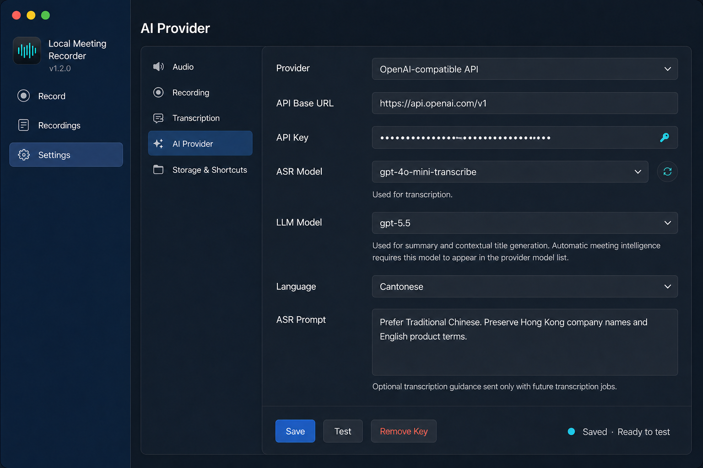
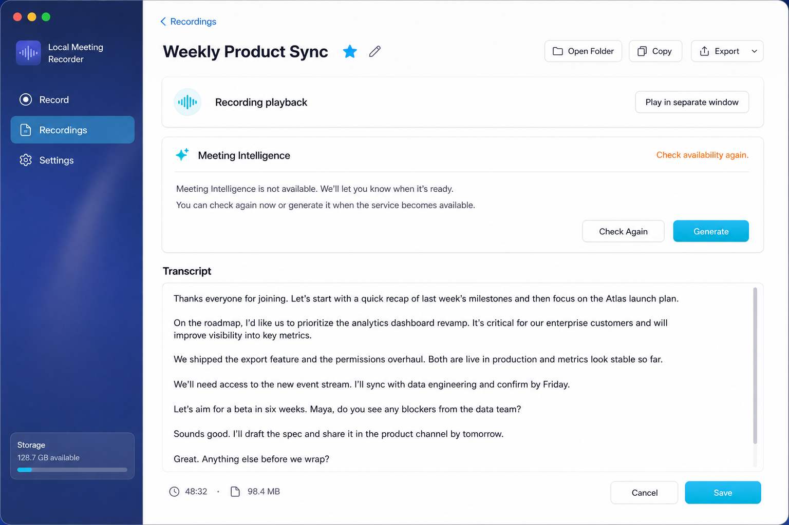
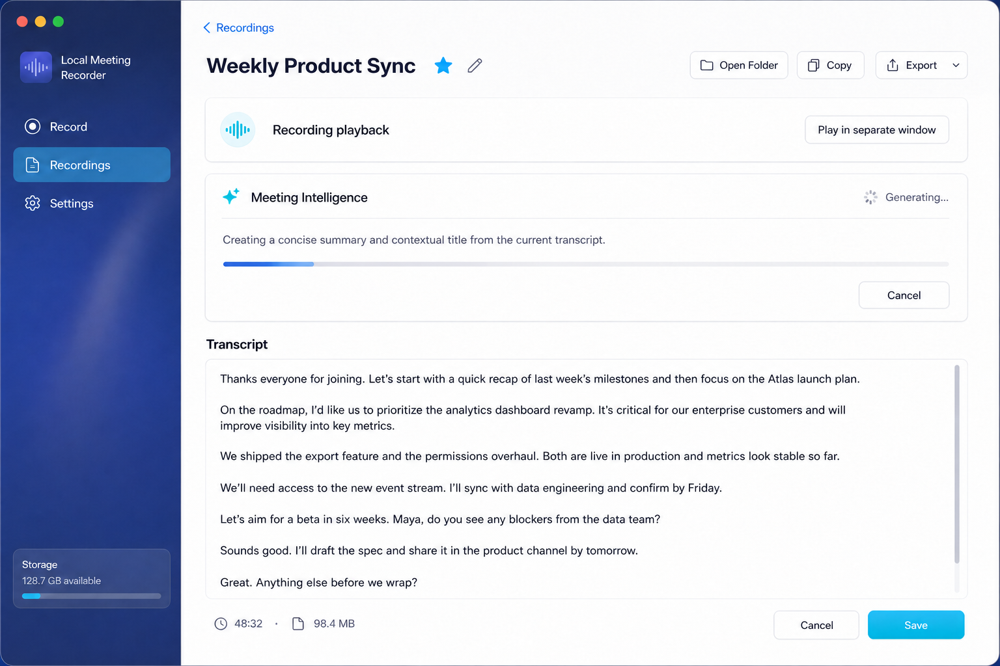
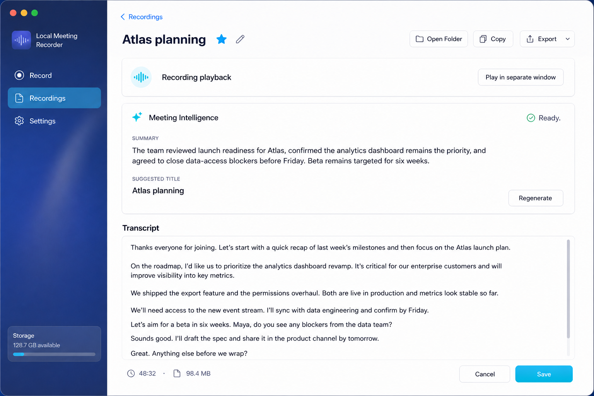
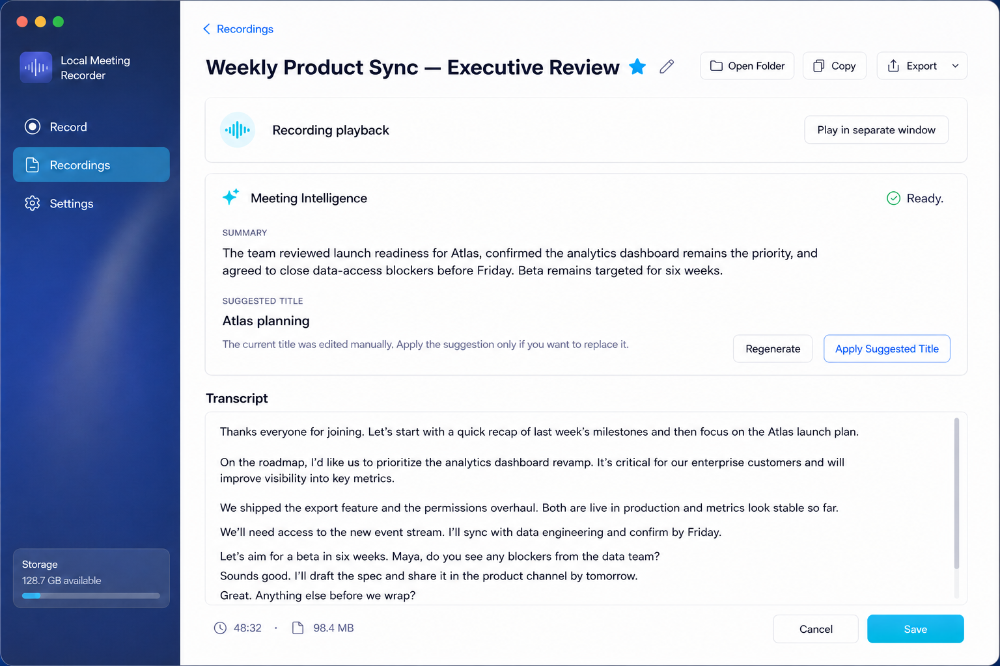

# Post-PR-B Liquid Glass and Motion UI Design

**Date:** 2026-08-01
**Status:** Approved for implementation on 2026-08-01
**Design branch:** `codex/pr7-liquid-glass-motion-ui`
**Design base:** `6fafacf` (`refactor: add transcription feature boundary`)
**Later integration target:** final head of `codex/refactor-library-transcription-mi-playback`
**Product baseline:** Draft PR #7 at `ab93955`
**Delivery identity:** a separate post-PR-B UI branch; this work is not PR #7

## 1. Purpose

This design brings the approved Liquid Glass workspace direction and restrained
Apple-native motion to the current recorder product represented by Draft PR #7.
It covers the existing Record, Recordings, transcript detail, Settings, AI
provider, transcription, Meeting Intelligence, playback, and error states.

This document does not rename or replace Draft PR #7. The work starts in an
isolated parallel branch while PR B continues to move
Library, Transcription, Meeting Intelligence, and Playback ownership out of the
monolithic `AppModel`. The UI branch will be rebased onto the final PR B head
before integration. It must consume the feature boundaries that PR B exposes;
it must not recreate or mirror their state.

Sharing base commit `6fafacf` does not share a working tree, index, or branch:
`codex/pr7-liquid-glass-motion-ui` and
`codex/refactor-library-transcription-mi-playback` are separate linked
worktrees. No UI commit may be written into the active PR B worktree.

## 2. Approved Direction

The user approved:

- the content hierarchy, controls, copy, and states shown in the six Image Gen
  reference frames in this spec;
- Liquid Glass limited to navigation and primary chrome;
- stable, opaque content surfaces for forms, transcript text, status, and
  Meeting Intelligence output;
- restrained Apple-native motion rather than expressive AI effects;
- the interactive motion sequence demonstrated in the visual companion:
  button press, AI waiting state, completion reveal, retry/cancel, save
  feedback, and Reduce Motion behavior.

## 3. Reference Frames

The images are visual references, not evidence that the feature is implemented
or accepted against a real provider. Their content hierarchy and state are
normative except for the unavailable-state explanatory copy called out below.
Their custom sidebars, second-level Settings navigation, gradients, materials,
separators, exact spacing, and window chrome are illustrative only. Production
uses the approved native `NavigationSplitView` and system-owned sidebar
material; it does not reproduce custom sidebar glass or overlays from the
images.

### Settings — HKT GenAI Platform

### Settings — OpenAI-compatible API

### Meeting Intelligence — availability not confirmed

The explanatory copy in this frame is illustrative and must not imply a
background notification or that generation is blocked until availability can
be confirmed. Production renders the feature's published `statusMessage`,
including discovery failures such as `Could not verify model discovery`, while
keeping both `Check Again` and the explicit `Generate` action available.

### Meeting Intelligence — generating

### Meeting Intelligence — ready and generated title applied

### Meeting Intelligence — manually protected title

## 4. Scope

### 4.1 Workspace shell

- Use native `NavigationSplitView` for Record, Recordings, and Settings.
- Let the system own sidebar material, selection, separators, toolbar
  placement, focus, and resizing.
- Use Liquid Glass only for navigation and a small number of primary control
  clusters. Do not apply glass to every card or text surface.
- Preserve the current 860×680 minimum and stable wide-window behavior.

### 4.2 Recordings

- Preserve search, Favorites, Upload Audio, refresh, row playback, folder,
  metadata, transcription, transcript, log, and Trash actions.
- Keep destructive actions visually subordinate and retain confirmation.
- Keep playback in its existing separate AppKit window. The workspace may show
  a compact playback command strip, but never embeds `AVPlayerView` in the main
  hierarchy.
- Animate row expansion and state replacement only; library ordering and
  canonical session identity remain owned by `LibraryFeatureModel`.

### 4.3 Transcript detail

- Use a substantial transcript workspace with fixed header and footer and a
  scrollable middle at the existing 860×680 minimum.
- Preserve the current title, favorite/edit, Open Folder, Copy, Export, Save,
  Cancel, transcript draft, duration, size, and playback command.
- The transcript draft stays stable while Library metadata or Meeting
  Intelligence presentation updates.
- Meeting Intelligence appears between the playback strip and transcript
  editor.

### 4.4 Meeting Intelligence

Render only PR #7's existing product states and commands:

- availability not confirmed: `Check Again` and `Generate`;
- checking or generating: native progress signal and `Cancel`;
- ready or stale: summary, suggested title, and `Regenerate`;
- failed, cancelled, or interrupted: recovery status and `Retry Generation`;
- manually protected title: the exact protection explanation and
  `Apply Suggested Title`.

For both a manually edited title and a deliberately cleared title, preserve PR
#7's existing protection copy exactly:

> The current title was edited manually. Apply the suggestion only if you want
> to replace it.

The UI branch does not revise this product copy. VoiceOver exposes the state as
`Manual title protected` in addition to the visible explanation.

No action items, decisions, risks, calendar actions, chat interface, fake
percentage, token counter, synthetic stage count, inferred speaker name, or
inferred timestamp is added.

### 4.5 AI provider settings

- Provider picker supports exactly `HKT GenAI Platform` and
  `OpenAI-compatible API`.
- HKT shows Group ID and the resolved fixed endpoint.
- Generic shows the editable API Base URL.
- Both show API key replacement, independent ASR and LLM model fields,
  discovered-model selection, language, ASR prompt, Save, Test, Remove Key,
  and status.
- View motion reflects the existing settings model only. Saving a provider
  affects future jobs and does not animate or mutate an active immutable job
  snapshot.

## 5. Motion Principles

1. **State first.** Animation follows a published state change. It never starts
   a job, delays a command, invents progress, or determines completion.
2. **Short and local.** Motion clarifies the control or content that changed;
   the rest of the window remains stable.
3. **Interruptible.** Cancel, Stop, Save, Retry, and navigation remain
   immediately actionable during an animation.
4. **Observed completion feedback.** While a destination remains visible,
   success animation occurs only when its observed feature snapshot changes
   from a non-ready phase to a ready phase. A destination opened directly in a
   ready state renders statically and does not replay completion motion.
5. **No high-frequency decoration.** Audio meters retain their existing
   bounded real-time updates and receive no blur, particles, or continuous
   layout animation.
6. **Accessible by construction.** Reduce Motion replaces scale, movement,
   pulse, shimmer, and stroke drawing with opacity or immediate state change.

## 6. Motion Choreography

### 6.1 Buttons

- Pointer down: scale to approximately 0.975 over 70–90 ms.
- Release: return using a restrained 160–200 ms spring.
- Hover may change material or border emphasis but does not translate the
  control.
- Disabled controls never animate as if accepted.
- Destructive actions do not bounce, glow, or draw extra attention.

The shared button style is applied to primary workflow actions, not every
small toolbar icon. Native controls keep native keyboard, focus ring, and
accessibility behavior.

### 6.2 Transcription and Meeting Intelligence state changes

- Status text cross-fades over about 160–220 ms.
- Mutually exclusive action groups transition together so old and new actions
  are not simultaneously interactive.
- Entering a working state uses the native `ProgressView` plus an optional
  moving indeterminate segment. The static reference frame captures one point
  in that movement; segment length and position do not represent progress. It
  never shows a percentage or determinate fraction.
- Summary and suggested title reveal with opacity and a vertical movement of
  no more than 6 points over about 220–300 ms.
- A transition observed from non-ready to ready draws a check once and then
  becomes static. Initial rendering of an already-ready snapshot is static.
- Failure uses an orange status and one subtle attention fade. It never shakes
  the card.

### 6.3 Generated title

- When Meeting Intelligence still owns the title and the visible detail view
  observes its displayed title change between two successive feature
  snapshots, the transcript header changes with a short cross-fade and a
  temporary low-opacity accent highlight.
- When the current title is manually owned or manually cleared, the header
  does not animate to the suggested title. Only the protection explanation and
  `Apply Suggested Title` action appear.
- The trigger is derived from the already-approved per-feature snapshot
  revision plus the previous and current `phase`, canonical session ID,
  displayed title, and title ownership values. It requires no new PR B product
  identity. View-local previous-snapshot bookkeeping is presentation ephemera:
  it starts from the first observed snapshot, never starts jobs, and is not
  persisted or mirrored into `AppModel`.

### 6.4 Navigation, sheets, and rows

- Destination changes rely primarily on native navigation transitions.
- Expanded recording content uses a short opacity plus small vertical reveal.
- Transcript and metadata sheets retain native macOS presentation and dismiss
  behavior.
- No custom full-window page slide is added.

### 6.5 Save and connection test

- Successful Save may temporarily replace its label with `Saved` and a check,
  then restore the normal label.
- Provider Test shows the model's real testing state using native progress and
  cross-fades to its real success or error text.
- A failed save or test never plays success feedback.

## 7. Motion Architecture

### 7.1 Shared presentation primitives

The implementation introduces a small UI-only motion layer, expected to
contain equivalents of:

- `RecorderMotionPolicy`: pure values selected from normal and Reduce Motion
  environments;
- `RecorderMotionButtonStyle`: press and release feedback for selected primary
  actions;
- `RecorderStatusTransition`: consistent status/action replacement;
- `RecorderObservedTransition`: pure comparison of previous/current immutable
  feature snapshots for ready and title-change feedback;
- `RecorderIndeterminateProgress`: decorative, non-numeric waiting signal that
  owns no product progress state.

Exact type names may change during planning, but the boundaries do not: these
types accept immutable presentation input and never import coordinators,
repositories, provider clients, or recording engines.

### 7.2 Feature observation

After rebasing onto PR B, views observe the owning feature model directly:

- Recordings and transcript metadata from `LibraryFeatureModel`;
- ASR status and commands from `TranscriptionFeatureModel`;
- summary/title status and commands from `MeetingIntelligenceFeatureModel`;
- playback presentation and commands from `PlaybackFeatureModel`.

Provider settings remain owned by the one existing
`AIProviderSettingsModel` during PR B. `AIProviderSettingsView` observes that
same injected instance and sends Save, Test, Remove Key, selection, and draft
editing through its existing API. The UI branch creates no view-local provider
profile draft, provider repository, credential state, Save/Test outcome, or
second observable model. PR C may later expose the same instance through
`SettingsFeatureModel` exactly as defined by the approved boundary design.

Temporary `AppModel` forwarding may remain only where PR B explicitly retains
it. The UI branch does not add new `AppModel` state or a second observable
mirror.

### 7.3 Integration isolation

The UI branch may change presentation files, pure presentation helpers, render
tests, and accessibility contracts. Until PR B finishes it must avoid:

- `AppModel` ownership or lifecycle changes;
- feature coordinator construction;
- cross-feature event bridges;
- provider transport, Keychain, artifact, transcript publication, or search
  indexing behavior;
- recording, Teams, virtual microphone, ScreenCaptureKit, or audio routing
  behavior.

Before integration, rebase this branch onto the final PR B head and resolve UI
API changes in favor of PR B's single-owner boundaries.

### 7.4 Allowed presentation changes

| Area | Allowed in this branch | Deferred / prohibited |
| --- | --- | --- |
| Shared UI | motion policy, button style, status transition, visual tokens, glass wrapper | runtime state, tasks, timers that represent product work |
| Workspace | native shell styling, destination composition, existing navigation animation | new destinations, custom sidebar material, lifecycle wiring |
| Record | apply shared button/status motion to existing controls | record layout redesign, capture or meter behavior |
| Recordings | row styling, state/action transition, search/list presentation | canonical list/search ownership, import/trash semantics |
| Transcript | layout styling, draft-safe presentation, MI card and motion | transcript persistence, playback ownership, title policy |
| Meeting Intelligence | immutable snapshot rendering and command buttons | job identity, availability, retry, cancellation, publication |
| Provider Settings | styling and motion over the injected existing settings model | provider draft/key ownership, transport, model discovery behavior |
| Tests | pure motion tests, render tests, real-duration interaction harness | altering PR B tests to weaken ownership or lifecycle contracts |

Expected overlap after the PR B rebase is limited to presentation-facing
sections of `ContentView.swift`, `RecordingsLibraryView.swift`, and their render
tests. New shared motion/style files and provider-view styling are expected to
be low-conflict. The implementation plan must list the final exact file
allowlist after rebasing; production commits are path-limited to that list.

## 8. Accessibility and System Settings

- Read `accessibilityReduceMotion` at the presentation boundary.
- Under Reduce Motion, remove scale, slide, pulse, shimmer, and stroke-draw
  effects. Use opacity or immediate updates.
- Retain textual statuses and icons; color or animation is never the only state
  signal.
- Preserve keyboard activation, focus ring, VoiceOver labels, stable action
  identifiers, and session-specific row labels.
- Honor Reduce Transparency through the existing Liquid Glass fallback and
  system materials.
- Continuous decorative animation pauses when its view is not visible.

## 9. Error and Cancellation Behavior

- Cancel is routed immediately to the owning feature. Its visual transition
  cannot debounce or defer the command.
- A cancelled or interrupted job transitions to the exact published recovery
  state. The view does not translate cancellation into failure or automatic
  retry.
- Completed transcription remains usable when Meeting Intelligence fails.
- Existing summary/title may remain visible during regeneration if the owning
  feature publishes them; the view does not clear durable output preemptively.
- Workspace or session changes invalidate old presentation revisions through
  the feature model. The UI does not animate a stale completion into the newly
  selected session.

## 10. Testing and Acceptance

### 10.1 Pure tests

- normal and Reduce Motion policies select the expected durations and
  transitions;
- working, ready, stale, failed, cancelled, and interrupted presentations map
  to the correct visible actions;
- success feedback triggers once when the visible destination observes a
  non-ready to ready transition and not on ordinary rerender or when opening an
  already-ready destination;
- manual title ownership never produces automatic title-application feedback;
- decorative waiting progress exposes no numeric product progress.
- Reduce Motion policy contains no scale, translation, pulse, shimmer, or
  stroke-draw effect; opacity or immediate replacement preserves all textual
  state.

### 10.2 Render and interaction tests

- render Record, Recordings, transcript detail, provider Settings, and every
  Meeting Intelligence state at 860×680 and a wide size;
- run deterministic render tests with animation duration disabled while
  separately testing the pure motion policy;
- use real AppKit mouse events for Generate, Cancel, Retry, Regenerate, Apply
  Suggested Title, Save, and provider Test;
- render each phase from one structural `switch`/exclusive action tree so only
  the current phase admits commands;
- run a real-duration transition harness that immediately disables outgoing
  actions with `allowsHitTesting(false)` and verifies an AppKit click during
  the visual transition reaches neither an outgoing nor stale command;
- prove transcript drafts and external playback presentation remain stable
  through title and summary updates;
- verify keyboard and accessibility identifiers are unchanged.

### 10.3 Manual staging acceptance

- compare normal and Reduce Motion behavior;
- confirm with VoiceOver and Reduce Motion that every status remains available
  as text and no meaning depends on animation;
- test light and dark appearance, Reduce Transparency, and increased contrast;
- inspect button press, provider test, ASR waiting, Meeting Intelligence
  generating, ready, failure, cancel, and retry flows;
- confirm no animation delays Stop, Mute, Cancel, Save, or navigation;
- record a non-gating Instruments observation during a 10-minute simulated
  wait to catch an obviously runaway decorative animation. Hardware-dependent
  CPU percentage is diagnostic evidence, not pass/fail acceptance for this PR;
- treat simulated/provider-fixture success as UI evidence only, not real HKT,
  Teams, TCC, AirPods, media, notarization, or production acceptance.

## 11. Delivery Sequence

1. Commit this design and visual references on the isolated UI branch.
2. Obtain written user review of this specification.
3. Write a TDD implementation plan against base `6fafacf`, explicitly marking
   files expected to conflict with the active PR B Library work.
4. Implement low-conflict presentation primitives and tests first.
5. Implement provider and Meeting Intelligence view styling against immutable
   presentations without changing ownership.
6. Wait for PR B to finish, then rebase onto its final head.
7. Adapt views to the final feature APIs, run the complete PR B and UI gates,
   and request independent review before any merge or PR update.

## 12. Non-goals

- No new AI product capability or output type.
- No action items, speaker diarization, live captions, calendar, or chat UI.
- No fake percentage or staged AI progress.
- No embedded playback view in the workspace hierarchy.
- No lifecycle, capture, Teams, media, provider, persistence, or publication
  changes.
- No merge into the active PR B worktree while it contains uncommitted work.
- No claim that Image Gen or browser prototypes are shipped application UI.
